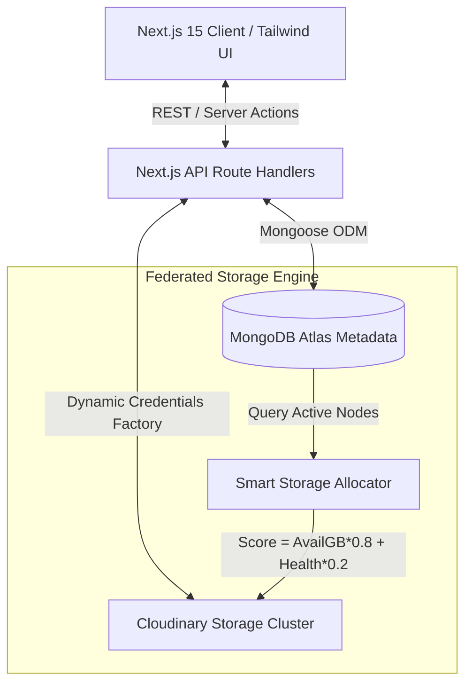

# VaultFS — Federated Knowledge & Resource Repository


**VaultFS** is a modern, enterprise-grade federated resource and knowledge management platform. Built with **Next.js**, **TypeScript**, **MongoDB Atlas**, and **Cloudinary**, it introduces a unique decentralized cloud storage orchestration model.

---

## 🌟 Executive Summary

### The Core Concept
Imagine a highly secure, private cloud drive (like Dropbox or Google Drive) combined with a peer-to-peer storage sharing network. In traditional cloud storage solutions, you are locked into a single centralized provider. **VaultFS** decouples the storage layer, allowing users to plug in their own independent cloud storage nodes (using Cloudinary accounts) and even "lease" excess storage capacity to other users in the network without compromising security or privacy.

### Key Capabilities & Product Highlights
VaultFS is architected to deliver high availability, intuitive state management, and a premium user experience across the stack:

- **Elegant Full-Stack Presentation:** Features a beautiful, modern Dark Mode UI built with Tailwind CSS, backed by a high-performance Next.js API.
- **Advanced Systems Design:** Implements complex architectural patterns including algorithmic storage routing, client-side cryptographic hashing, and automated cascade cleanup.
- **Flawless Asset & Knowledge Management:** Every interaction is optimized for productivity, offering built-in viewers for PDFs, streaming video, interactive Markdown notes, and external web bookmarks.
- **Strict Security & Scalability:** Operates on zero-trust access control principles, featuring immutable audit logs and a complete separation of concerns between database metadata and external storage providers.

---

## 🛠️ System Architecture

VaultFS utilizes a highly modular, decoupled architecture designed for fault tolerance and secure resource federation.



### ⚡ Technical Highlights & Architectural Decisions

#### 1. Strict Separation of Metadata vs. Physical Storage
- **Metadata Layer:** Handled entirely by MongoDB Atlas via Mongoose with optimized connection caching. Stores folder hierarchies, tags, access control lists, sharing leases, and event audit trails.
- **Physical Storage Layer:** Decoupled entirely from the database. Actual media payloads (PDFs, videos, images) are chunked and streamed directly to dynamically configured Cloudinary nodes.

#### 2. Algorithmic Storage Routing
When a user uploads a file, VaultFS dynamically evaluates the user's available storage nodes and active peer leases to select the optimal destination based on a custom scoring algorithm:
$$\text{Score} = (\text{AvailableStorageGB} \times 0.8) + (\text{NodeHealthScore} \times 0.2)$$
This ensures automatic load balancing and prevents attempting uploads to degraded or full storage accounts.

#### 3. Zero-Trust Storage Leases & Federation
Users can request storage allocation from peers within the network. 
- **The Guarantee:** A storage provider grants raw byte allocation only. Providers cannot access, view, or modify the consumer's file metadata or contents. Access authorization is strictly verified against the user's session ID and resource ownership documents in MongoDB.

#### 4. Content-Addressable Asset Deduplication
Before uploading, files are processed client-side to generate a secure SHA-256 cryptographic hash. This provides verifiable data integrity and lays the groundwork for global asset deduplication across storage nodes.

#### 5. Automated Health Checking & Failover
VaultFS includes an automated cron route (`/api/cron/health`) and an on-demand API handler (`/api/storage/health`) that ping all registered storage nodes. Nodes that fail to respond correctly receive a degraded health score and are marked `OFFLINE` after 3 consecutive failures, automatically removing them from the active upload routing pool.

#### 6. Robust Cascade Cleanup
Deleting a parent folder triggers a complete recursive cascade cleanup. The backend service identifies all nested subfolders and child resources, dynamically authenticates with the respective storage nodes to securely destroy physical Cloudinary assets, removes the database documents, and records immutable `RESOURCE_DELETED` audit events.

---

## 🖥️ Comprehensive Features List

- **Robust Authentication:** Secure registration, login, and session persistence powered by **NextAuth v5 (Auth.js)**.
- **Rich Multimedia Presentation:** 
  - **PDF Viewer:** Custom embedded PDF presentation.
  - **Streaming Video Player:** Integrated HTML5 video player for uploaded MP4/WebM media.
  - **Interactive Notes:** Rich Markdown viewer and editor for knowledge-base documentation.
  - **External Embeds:** Seamless YouTube integration and clickable resource bookmarks.
- **Folder Orchestration:** Build deep, nested directory trees, execute smooth inline renaming, and perform complete cascade deletions with highly explicit user confirmation safeguards.
- **System Audit Logging:** An immutable activity log capturing resource creation, updates, sharing modifications, and storage lease status changes.

---

## 🚀 Quick Start & Setup Guide

### 1. Prerequisites
- **Node.js** (v18 or higher)
- **MongoDB Atlas** connection URI (or local MongoDB instance)
- At least one **Cloudinary** account (for registering physical storage nodes)

### 2. Environment Variables Configuration
Create a `.env.local` file in the root directory of the project:

```env
# MongoDB Connection String
MONGODB_URI="mongodb+srv://<username>:<password>@cluster0.mongodb.net/vaultfs?retryWrites=true&w=majority"

# NextAuth Configuration
NEXTAUTH_URL="http://localhost:3000"
NEXTAUTH_SECRET="your-32-character-random-secret-key-goes-here"

# Cron Endpoint Security Secret
CRON_SECRET="optional-cron-security-token"
```
*(Tip: Generate a secure secret using `openssl rand -base64 32`)*

### 3. Install Dependencies
```bash
npm install
```

### 4. Seed the Database
Populate your database with demo users, sample folder trees, and mock knowledge items:
```bash
npm run db:seed
```

### 5. Start the Development Server
```bash
npm run dev
```
Navigate to [http://localhost:3000](http://localhost:3000) in your web browser.

### 🔑 Demo User Credentials
You can immediately test the platform and explore peer leasing by logging in with either of the seeded accounts:
- **User 1 (Alice):** `alice@vaultfs.local` | Password: `password123`
- **User 2 (Bob):** `bob@vaultfs.local` | Password: `password123`

---

## 📁 Clean Architecture & Project Structure

```text
vaultfs/
├── src/
│   ├── app/                  # Next.js App Router (Pages, Layouts, API Handlers)
│   │   ├── (dashboard)/      # Protected Application Routes (Dashboard, Folders, Storage)
│   │   └── api/              # Serverless API REST Endpoints & Webhooks
│   ├── components/           # Modular React Client & Server Components
│   │   ├── folders/          # Folder navigation, cards, and creation modals
│   │   ├── resources/        # Asset cards, multimedia viewers, upload modals
│   │   ├── storage/          # Storage node orchestration & leasing interface
│   │   └── ui/               # Reusable Tailwind design system elements (Card, Button, Modal)
│   ├── lib/                  # Core Business Logic & Infrastructure
│   │   ├── auth/             # NextAuth authentication configurations
│   │   ├── db/               # Mongoose caching connection infrastructure
│   │   ├── models/           # Mongoose Data Schemas (User, Folder, Resource, StorageNode, Lease)
│   │   ├── services/         # Domain Services (Orchestration, Routing, Cascade Deletion)
│   │   └── storage/          # Cloudinary dynamic factory & streaming upload handlers
│   └── types/                # Shared TypeScript Type Definitions
└── package.json
```

---

## 🛡️ License
This project is licensed under the MIT License.
